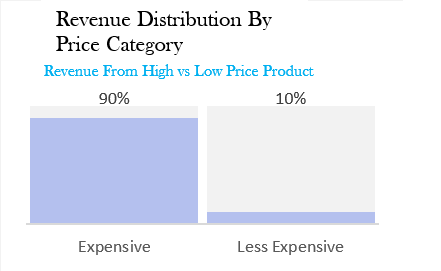
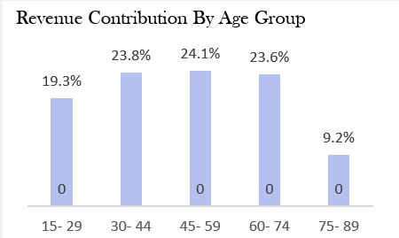
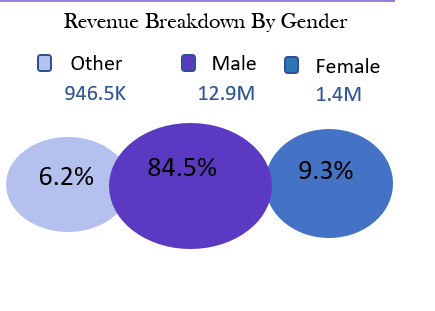
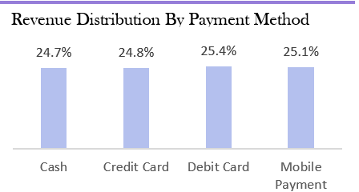
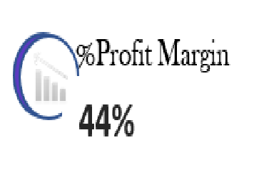
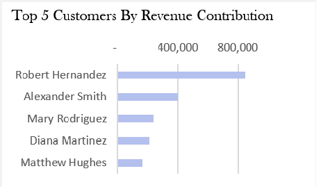
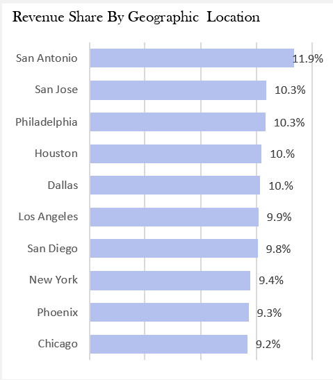
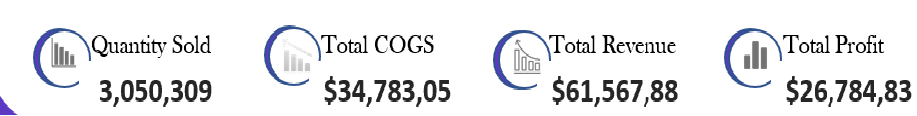

# 📊 B&J Biscuit Business Analysis

## Project Overview

This project features a comprehensive set of Excel dashboards developed for B&J Biscuit Company. The primary dashboard **(Dashboard 1)** offers a holistic view of the business, providing key insights into revenue distribution, profitability, customer demographics, geographic performance, and overall sales metrics. 

**Dashboard 2**, on the other hand, focuses on providing a deeper, time-based analysis of revenue trends. This dashboard delves into monthly, quarterly, and weekly revenue performance, offering insights into month-over-month changes to help identify seasonal patterns, sales spikes, and business cycles. 

_This project uses data I obtained through the YouTube channel DataWithDecision365 to carry out a detailed business analysis for B&J Biscuit._ 

## Problem Statement
This project was designed to answer the following strategic questions and provide actionable business insights:

- **Revenue Distribution:**
  - How is revenue distributed across high-priced and low-priced products?
  - What revenue trends exist across age groups and gender?
  - Which payment methods generate the most revenue?

- **Profitability:**
  - Which brand, location, customer, and salesperson generate the most profit?
  - What is the overall profit margin of the business?

- **Customer Insights:**
  - Who are the top 5 customers by revenue contribution?
  - What is the total number of customers acquired?

- **Geographic Revenue Distribution:**
  - What is the revenue share across key geographic locations?

- **Sales Performance:**
  - Show the key metrics such as quantity sold, total revenue, total cost of goods sold (COGS), and total profit.

## Tools & Features Used

- **Excel Functions:** `INDEX`, `MATCH`, `IF`, `VLOOKUP`,
- **Macros (VBA):**
  - Used Excel's Macro Recorder (VBA) to create and configure Slicers dynamically
  - Automated data refresh and formatting
- **Other Features:**
  - Pivot Tables
  - Data Validation
  - Conditional Formatting
  - Charts for dynamic data visualization
  - Slicers for interactive filtering

 ## Dashboard Build
 
  1. - **📊 Chart:** Bar chart showing revenue distribution across high-priced and low-priced products.
     
     - **Explanation:** This chart helps identify the percentage of revenue generated by each category, allowing for a quick comparison of the sales performance of high vs. 
     low-priced products.
  - **Chart:** Showing the revenue trends across different age groups and gender.

  - *By Age Group:*  
    
    This visual shows the current profit margin of the business in real-time. The gauge changes dynamically based on the latest data.
 
 - *By Gender:*  
    

_The line chart reveals trends over time for revenue generation by age group and gender. Filters can be applied to isolate specific periods or demographics._
**Chart:**  illustrating the revenue share across various payment methods.
   
    
  _The chart breaks down total revenue by payment method. Users can see the dominant payment methods and make data-driven decisions accordingly._
     
2. **Chart:** showing profitability across different brands, locations, customers, and salespeople.
   
 _The chart shows which entities are contributing the most to profitability. You can use slicers to filter by location or brand to drill down into specific areas._

3. - **Chart:** Gauge chart displaying the overall profit margin.
   -  
   
   _This visual shows the current profit margin of the business in real-time. The gauge changes dynamically based on the latest data._

4. **Chart:** Table or bar chart highlighting the top 5 customers.

    

   _The table lists the top customers based on their revenue contribution, helping to identify key clients._

6. **Chart:** Map chart or bar chart showing revenue distribution by location.
   

   ** This visual presents revenue share by geographic regions.

7. **Chart:** Multi-metric dashboard with KPIs for quantity sold, total revenue, COGS, and profit.
    

    _This dashboard section aggregates key metrics for sales performance, allowing users to assess the health of the business at a glance. Slicers help filter by time periods, products, or other relevant categories._

   
        
