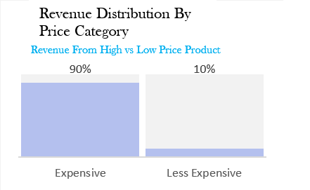
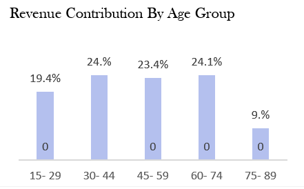
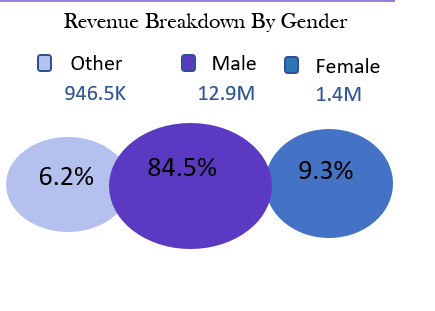
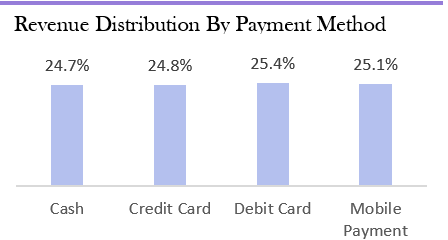
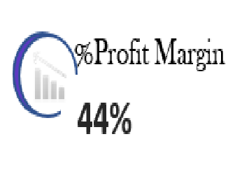
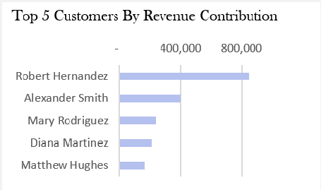
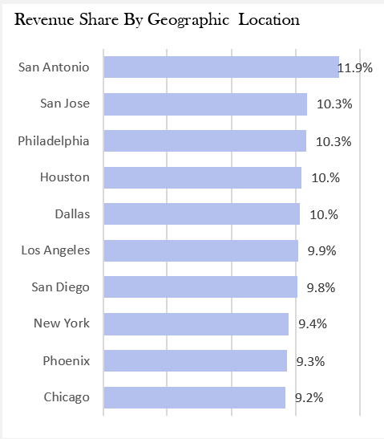
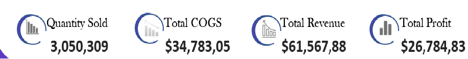

## Problem Statement

This project aims to deliver actionable business insights by addressing the following strategic questions:

### 1. Revenue Distribution
- How is revenue distributed between high-priced and low-priced products?
- What are the revenue trends across age groups and gender?
- Which payment methods contribute the most to revenue?

### 2. Profitability
- Which brand, location, customer, and salesperson generate the most profit?
- What is the overall profit margin of the business?

### 3. Customer Insights
- Who are the top 5 customers based on revenue contribution?

### 4. Geographic Revenue Distribution
- What is the revenue share across key geographic locations?

### 5. Sales Performance
- Display key metrics:
  - Quantity Sold
  - Total Revenue
  - Total Cost of Goods Sold (COGS)
  - Total Profit

## 📊 Dashboard Build

### 1. 💰 Revenue Distribution

**📈 Chart: Revenue by Product Price Category**  

Insights:

High-priced products account for approximately 90% of total revenue ($55.21M), driven by strong demand and premium pricing (e.g., Shortbread at $45, Vanilla Wafers at $36). This highlights the company’s reliance on a smaller range of high-value items for the bulk of its income.

In contrast, lower-cost items contribute around 10% ($6.35M), with prices between $5 and $9. While their individual margins are lower, their high sales volume indicates strong appeal among price-sensitive customers, supporting broader market reach and customer acquisition.
Business Implications:
The company’s revenue is heavily dependent on premium products, highlighting their profitability. However, lower-priced items play a key role in customer acquisition and broadening market reach.

Strategic Opportunity: While premium products remain the revenue core, promoting high-margin, lower-priced items (e.g., Lemon Crisps with ~22% margin) could enhance profitability without compromising volume.

**👥 Chart: Revenue by Age Group**  

A line chart showing revenue trends across different age groups. Use filters to isolate specific age brackets or time periods.

Insights:

Top Contributors (Ages 30–74):
This group drives over 71.5% of revenue, with 60–74 slightly leading. They are the company’s core customer base.

Young Shoppers (15–29):
Contributing 19.44%, this group shows potential for long-term growth and brand loyalty despite lower current spend.

**🚻 Chart: Revenue by Gender**  
 

This line chart highlights gender-based revenue trends. Demographic filters help tailor the analysis for targeted insights.

**💳 Chart: Revenue by Payment Method**  

The revenue distribution across payment methods reveals a tightly contested landscape, with no single method dominating. Debit Cards lead slightly, accounting for 25.4% of total revenue, or approximately $15.62 million, suggesting a mild preference for direct bank transactions. Close behind are Mobile Payments at 25.11% ($15.46 million), reflecting growing adoption of digital wallets and tech-savvy customer behavior. Credit Cards and Cash follow closely at 24.77% and 24.75%, respectively, with Cash bringing in the lowest total revenue of around $15.24 million. The narrow range between the highest and lowest contributors—just about $382,000 or 0.62%—highlights the diverse and balanced payment preferences among customers, though the slightly lower share of Cash may point to a gradual shift away from physical currency.

---

### 2. 📈 Profitability Analysis

**🏷️ Chart: Profitability by Brand, Location, Customer, and Salesperson**  
 
This visual pinpoints who or what is driving profitability. Slicers allow users to drill down into specifics like brand or region.

---

### 3. 📊 Overall Profit Margin

**📟 Chart: Profit Margin Gauge**  

A dynamic gauge chart displaying real-time profit margin, providing quick insight into business health.

---

### 4. 🏆 Top Customers

**👑 Chart: Top 5 Customers by Revenue**  
 
This table or bar chart ranks the top 5 customers by their revenue contribution, highlighting key clients.

---

### 5. 🌍 Geographic Revenue Distribution

**🗺️ Chart: Revenue by Geographic Location**  

A map or bar chart showing how revenue is distributed across different regions or cities.

---

### 6. 📌 Sales Performance KPIs

**📊 Chart: Sales Dashboard (Quantity Sold, Revenue, COGS, Profit)**  

This dashboard aggregates key performance metrics to give a snapshot of overall sales performance. Filters allow dynamic exploration of data over time, by product, or category.
